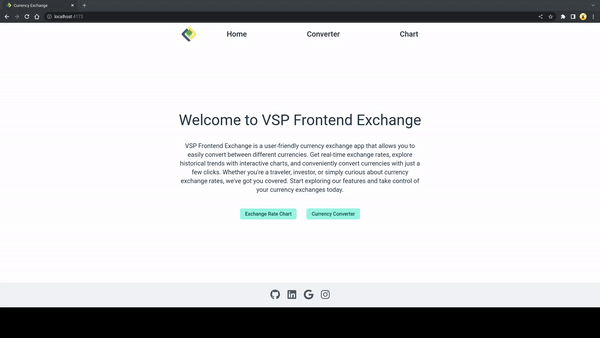
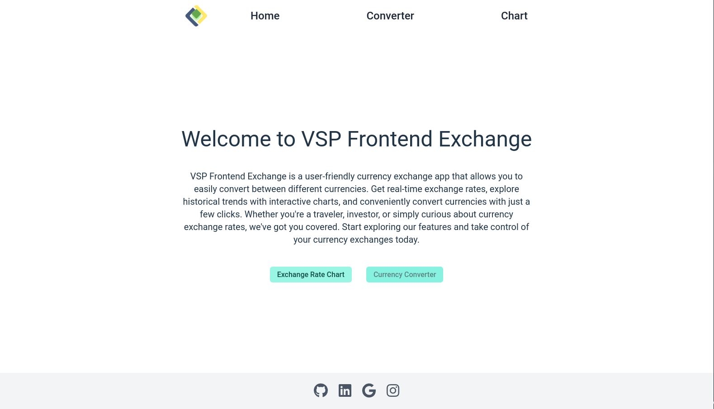
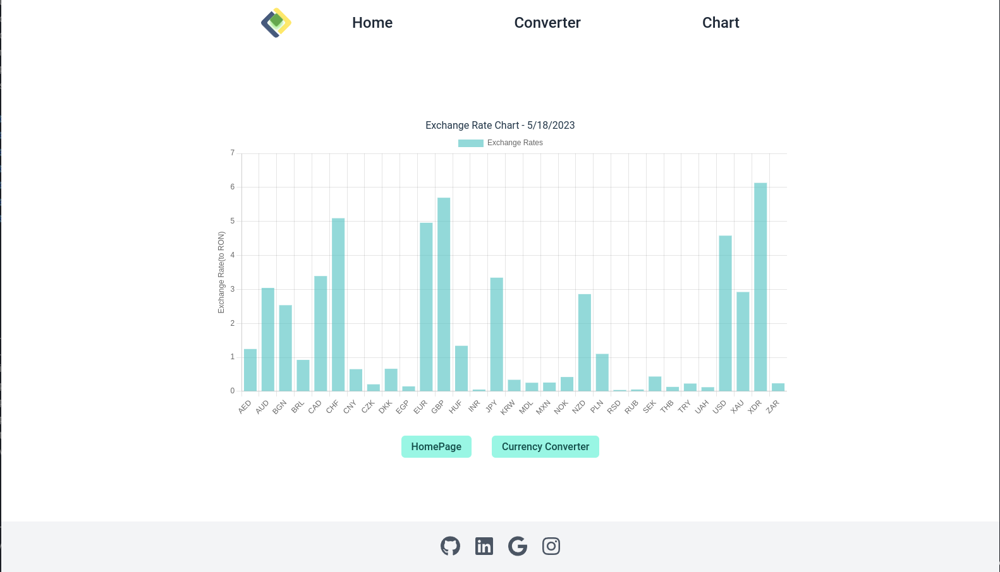

# VSP Frontend Exchange

VSP Frontend Exchange is a currency exchange app built with React and Tailwind CSS. It utilizes the BNR (National Bank of Romania) API to retrieve exchange rate data and provides features such as currency chart visualization and currency conversion.

## Installation

Clone the repository:

git clone git@github.com:RaevschiCatalin/VSP-frontend.git

Navigate to the project directory:

cd VSP-frontend

Install the dependencies:

npm install

## Usage

Navigate to the project's source folder:

cd your-project-name/src

Start the server:

node server.js

Make note of the host name and port displayed in the console, e.g., "Server listening on http://localhost:3431".

Open another terminal window and navigate back to the project directory:

cd ../..

Start the development server:

npm run dev

or

npm run preview

The app will be accessible in your browser using the host and port provided by the server. For example, if the server is running on "http://localhost:8000", you should access the app at http://localhost:8000.

**Note:** If you're unable to see the currency chart, you can try fixing it by navigating to "server.js" in the project's root folder and changing the "PORT" constant to match the port number provided by your local server.
## Features

- Currency Chart Visualization: View exchange rate data in the form of an interactive chart.

- Currency Conversion: Convert amounts between different currencies using real-time exchange rates.

- BNR API Integration: Utilize the BNR (National Bank of Romania) API to fetch accurate exchange rate data.
- Local Data Storage: Store exchange rate data locally to improve performance and reduce API calls.
- Beautiful UI: Enjoy a visually appealing and user-friendly interface built with React and Tailwind CSS.
- A cute animation that plays when you load the website.

## Contributing

Contributions are welcome! If you have any suggestions or find any issues, please open an issue or submit a pull request.

## License

This project is made for a internship Frontend challange at Victory Square Partners.

## Acknowledgements

- React (https://reactjs.org)
- Tailwind CSS (https://tailwindcss.com)
- BNR API (https://www.bnr.ro/Cursurile-pietei-valutare-in-format-XML-3424.aspx)
